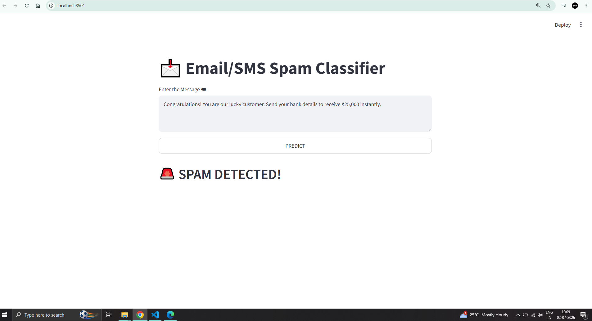
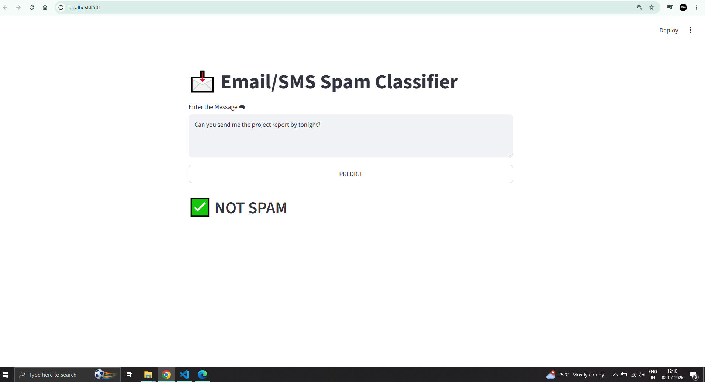

# 📩 SMS Spam Detection using Machine Learning

An end-to-end **Natural Language Processing (NLP)** project that classifies SMS messages as **Spam** or **Ham (Not Spam)** using **TF-IDF Vectorization** and **Naive Bayes**. The application is deployed as an interactive web app using **Streamlit** on **Hugging Face Spaces**.

---

## 🚀 Live Demo

🔗 **Hugging Face:**  
[YOUR_HUGGINGFACE_LINK](https://huggingface.co/spaces/ShaanVM/sms-spam-detector)

---

## 📌 Project Overview

SMS spam messages are a common source of phishing attacks and fraudulent activities. This project uses **Natural Language Processing (NLP)** and **Machine Learning** to automatically classify incoming SMS messages as either:

- 🚨 Spam
- ✅ Ham (Not Spam)

The application performs text preprocessing, feature extraction using TF-IDF, and classification using a trained Machine Learning model.

---

## ✨ Features

- Interactive Streamlit Web Application
- Text Preprocessing Pipeline
- Tokenization
- Stopword Removal
- Stemming using Porter Stemmer
- TF-IDF Vectorization
- Spam Prediction in Real-Time
- Clean and User-Friendly Interface
- Deployed on Hugging Face Spaces

---

## 🛠️ Tech Stack

### Programming Language
- Python

### Libraries
- Pandas
- NumPy
- Scikit-learn
- NLTK
- Streamlit
- Pickle

### Machine Learning
- TF-IDF Vectorizer
- Naive Bayes Classifier

### Deployment
- Hugging Face Spaces

## ⚙️ Workflow

1. Load SMS Spam Dataset
2. Perform Data Cleaning
3. Exploratory Data Analysis (EDA)
4. Text Preprocessing
    - Lowercasing
    - Tokenization
    - Removing Special Characters
    - Stopword Removal
    - Stemming
5. Convert Text to Numerical Features using TF-IDF
6. Train Machine Learning Model
7. Evaluate Performance
8. Save Model using Pickle
9. Build Streamlit Application
10. Deploy on Hugging Face

---

## 📸 Application Preview

### Spam Prediction

### Ham Prediction

## 📚 Dataset

https://www.kaggle.com/datasets/uciml/sms-spam-collection-dataset